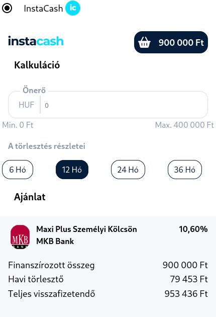

# InstaCash Point of Sale Woocommerce Plugin

## Description

A payment service gateway to Woocommerce webshops that allows a customer to initiate a short online loan application to cover a purchase.

From the available online offers of the InstaCash Application, we get a calculated amount based on which we can start the application process.

## Integration flow

### You must first enable the plugin to set up your payment method.

### You need to configure the plugin to provide additional information to customers.
- Add title
- Add description (optional)
- Provide instructions to customers after placing an order (optional)
- Get API Key from merchant portal (required)

#### Notification for get API Key

#### Options Page

### Once the settings are in place, the payment service must be enabled.

### This will eventually appear on the user page.

